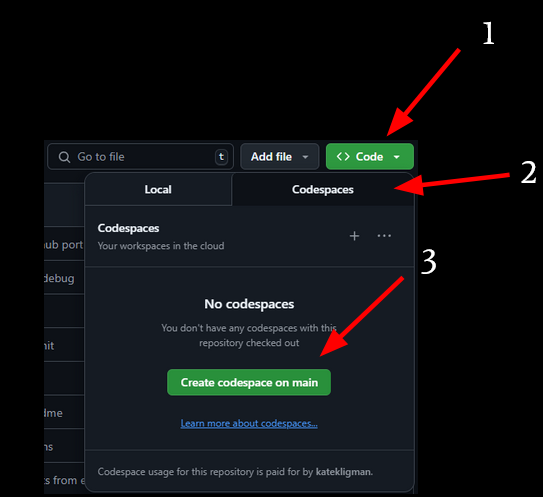

# Open Source Workshop - April, 2025

## Getting Started

First, create a GitHub account, login, and return to this repository on GitHub.

To create the Codespace:

1. Click "Code"
2. Click the "Codespaces" tab
3. Click "Create codespace on main"

